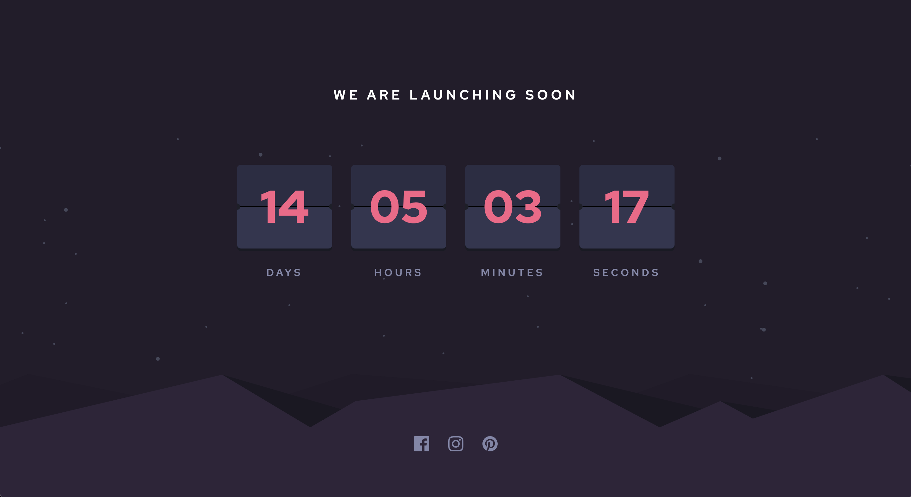

# Frontend Mentor - Launch countdown timer solution

This is a solution to the [Launch countdown timer challenge on Frontend Mentor](https://www.frontendmentor.io/challenges/launch-countdown-timer-N0XkGfyz-). Frontend Mentor challenges help you improve your coding skills by building realistic projects.

## Table of contents

- [Overview](#overview)
    - [The challenge](#the-challenge)
    - [Screenshot](#screenshot)
    - [Links](#links)
- [My process](#my-process)
    - [Built with](#built-with)
    - [What I learned](#what-i-learned)
    - [Continued development](#continued-development)
    - [Useful resources](#useful-resources)
- [Author](#author)

## Overview

### The challenge

Users should be able to:

- See hover states for all interactive elements on the page
- See a live countdown timer that ticks down every second (start the count at 14 days)

### Screenshot

### Links

- Solution URL: [Solution URL](https://github.com/amjadsh97/launch-countdown-timer)
- Live Site URL: [Live site](https://launch-countdown-timer-sepia.vercel.app/)

## My process

### Built with

- Semantic HTML5 markup
- CSS custom properties
- Flexbox.
- [React](https://reactjs.org/) - JS library.

## What I Learned

During this project, I reinforced my understanding of manipulating the Date object in JavaScript and effectively creating responsive web applications.

## Continued Development

Moving forward, I am keen to focus on implementing animations,
specifically achieving a flip animation from the center, to enhance
the visual appeal and interactivity of the project.

### Useful resources

- [React Docs](https://react.dev/) - This helped me for building react components. I really liked using this docs.

## Author

- Website - [Amjad Shadid](https://amjadshadid.vercel.app/)
- Frontend Mentor - [@amjadsh97](https://www.frontendmentor.io/profile/amjadsh97)
- Twitter - [@Amjadshadid](https://twitter.com/Amjadshadid)
- Linkedin - [@Amjad Shadid](https://www.linkedin.com/in/amjad-shadid-134355134/)